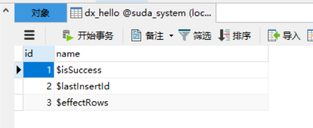
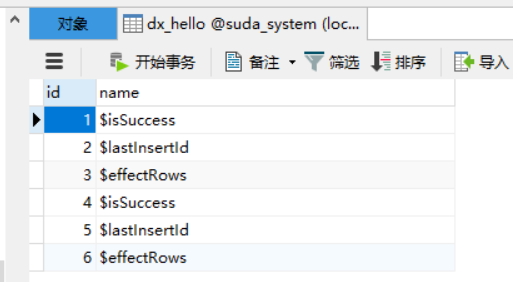
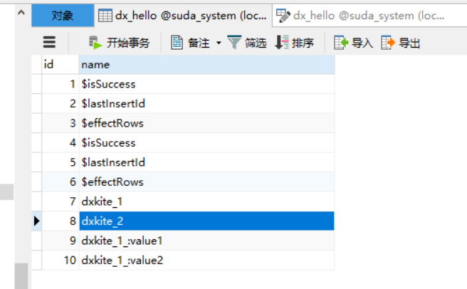

# 添加记录

在添加记录之前，需要创建好数据库，本次测试的数据库为：

```SQL
CREATE TABLE `dx_hello` (
	`id` BIGINT(20) NULL AUTO_INCREMENT,
	`name` VARCHAR(80) NULL,
	PRIMARY KEY (`id`)
) ENGINE=InnoDB DEFAULT CHARSET=utf8mb4;
```

数据库配置文件如下：

```json
{
    "master": {
        "type": "mysql",
        "enable": true,
        "prefix": "dx_",
        "mode": "read+write",
        "host": "127.0.0.1",
        "port": 3306,
        "name": "suda_system",
        "user": "root",
        "password": "root",
        "charset": "utf8mb4"
    }
}
```

## write 添加一条记录

使用上一节我们创建的 HelloTable 类，我们可以添加一条记录：

```php
$table = new HelloTable();

$isSuccess = $table->write([
    'name' => '$isSuccess',
])->ok(); // true

$lastInsertId = $table->write([
    'name' => '$lastInsertId',
])->id(); // 2

$effectRows = $table->write([
    'name' => '$effectRows',
])->rows(); // 1
```

其中，write函数支持一个键值对数组，键名为数据库的字段名，值为插入的值，在调用write方法之后需要调用如下之一的方法

- ok 执行并返回执行结果
- id 执行并返回自增ID的值
- rows 执行并返回操作影响的数据记录数

当语句执行之后，数据表内容为如下




## query 操作

### 直接插入

当语句比较特殊时，可以使用query函数操作，如取 `hello` 表的数据再次插入 `hello` 表 ：

```php
try {
    $table = new HelloTable();
    $effectRows = $table->query('INSERT INTO _:hello ( `name`) SELECT name FROM _:hello')->rows();
    $application->debug()->info('effect rows {rows}', ['rows' => $effectRows]);
} catch (\ReflectionException $e) {
} catch (\suda\database\exception\SQLException $e) {
}
```

**注：** `_:` 为自动前缀，当数据库配置中设置了前缀则会变为数据表的前缀，如果没有设置则为 `''`

结果如下




### 带参数的插入

**占位符 `?`**

支持可变长参数，在SQL语句中使用 `?` 作为占位符输入值

```php
try {
    $table = new HelloTable();
    $effectRows = $table->query('INSERT INTO _:hello ( `name`) VALUES (?),(?)', 'dxkite_1', 'dxkite_2')->rows();
    $application->debug()->info('effect rows {rows}', ['rows' => $effectRows]);
} catch (\ReflectionException $e) {
} catch (\suda\database\exception\SQLException $e) {
}
```

**占位符`:键名`**


支持键值对数组参数，在SQL语句中使用 `:键名` 作为占位符输入值

```php
try {
    $table = new HelloTable();
    $effectRows = $table->query('INSERT INTO _:hello ( `name`) VALUES (:value1),(:value2)', [ 'value1' => 'dxkite_1_:value1', 'value2' => 'dxkite_1_:value2'])->rows();
    $application->debug()->info('effect rows {rows}', ['rows' => $effectRows]);
} catch (\ReflectionException $e) {
} catch (\suda\database\exception\SQLException $e) {
}
```


操作之后，数据表内容如下

