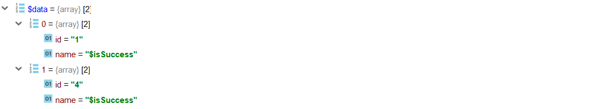
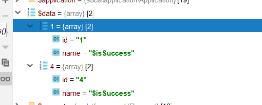
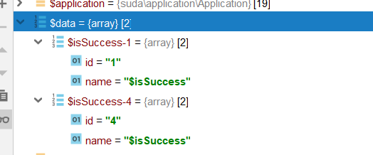

# 读取记录

读取记录可以使用read函数读取，读取 hello 表中记录：


```php
try {
    $table = new HelloTable();
    $data = $table->read(['id', 'name'])->where(['name' => '$isSuccess'])->all();
} catch (\ReflectionException $e) {
} catch (\suda\database\exception\SQLException $e) {
}
```

以上写法会生成类似如下的SQL语句：

```SQL
SELECT `id`,`name` FROM dx_hello WHERE `name`=:_name_0
```

查询结果:




说明

- `one`() 取一行
- `all`() 取全部行

## where 函数

where函数支持多种用法，具体用法如下

```php
// 第一个参数为数组时
$table->read(['id', 'name'])->where(['name' => 'value' ])  
// SELECT `id`,`name` FROM dx_hello where name = :name

// 第一个参数为字符串，第二个参数为数组时
$table->read(['id', 'name'])->where('name like :key', ['key' => '%value%' ])  
// SELECT `id`,`name` FROM dx_hello where name like :key

// 第一个参数为字符串，第二个参数为非数组时（可变长参数
$table->read(['id', 'name'])->where('name like ?', '%value%')  
// SELECT `id`,`name` FROM dx_hello where name like :_0

// 当参数值为 ArrayObject 时
$table->read(['id', 'name'])->where('id in (:key)', ['key' => new ArrayObject([1,2,3]) ])  
// SELECT `id`,`name` FROM dx_hello where id in (:_1,:_2,:_3)

// 当参数值为 ArrayObject 时
$table->read(['id', 'name'])->where('id in (?)', new ArrayObject([1,2,3]))  
// SELECT `id`,`name` FROM dx_hello where id in (:_1,:_2,:_3)

// 当参数值为数组时
$table->read(['id', 'name'])->where(['id' => ['>' , 2]])  
// SELECT `id`,`name` FROM dx_hello where id > :_0

// 当参数值为 ArrayObject 时
$table->read(['id', 'name'])->where(['id' => new ArrayObject([1,2,3]) ])  
// SELECT `id`,`name` FROM dx_hello where id in (:_1,:_2,:_3)
```

## withKey 和 withKeyCallback

可以使用函数或者某一字段作为键名


```php
try {
    $table = new HelloTable();
    $data = $table->read(['id', 'name'])->where(['name' => '$isSuccess'])
        ->withKey('id')
        ->all();
} catch (\ReflectionException $e) {
} catch (\suda\database\exception\SQLException $e) {
}
```



```php
try {
    $table = new HelloTable();
    $data = $table->read(['id', 'name'])->where(['name' => '$isSuccess'])
        ->withKeyCallback(function ($value) {
            return $value['name'].'-'.$value['id'];
        })
        ->all();
} catch (\ReflectionException $e) {
} catch (\suda\database\exception\SQLException $e) {
}
```

