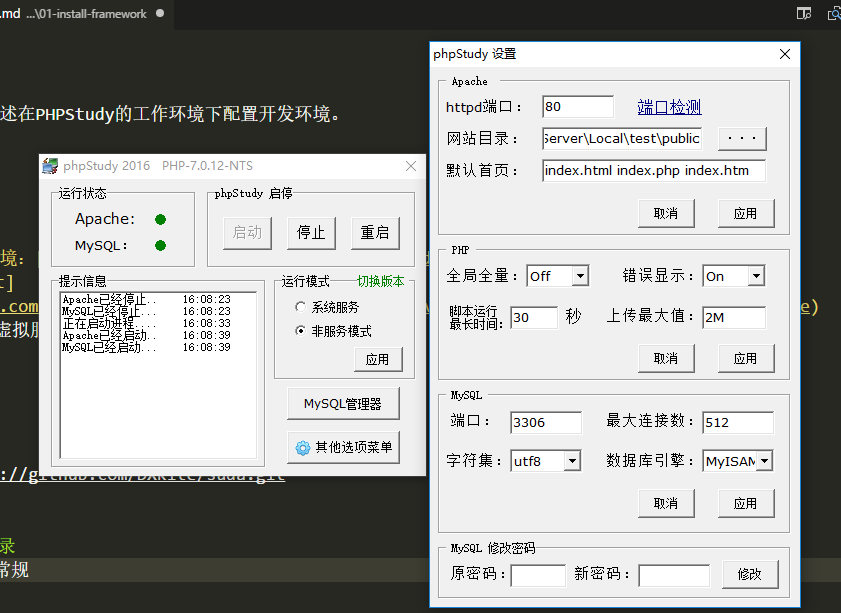
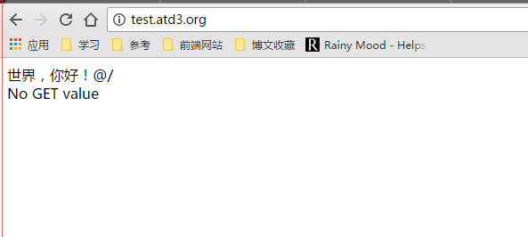

## 如何安装框架

@author:dxkite
@time:2017-05-25
@dis: 本课将会讲述在PHPStudy的工作环境下配置开发环境。

---

### 开始前准备
1. 下载PHP学习环境：[phpstudy 2016.11.03](http://www.phpstudy.net/phpstudy/phpStudy20161103.zip)
2. 下载Git: [Git](https://github.com/git-for-windows/git/releases/download/v2.13.0.windows.1/Git-2.13.0-64-bit.exe)
安装完成后配置个虚拟服务器，开启服务

### 下载框架

运行命令:
```
git clone https://github.com/DXkite/suda.git
```
把 suda/public 下的文件复制到网站根目录。


### 配置网站根目录
打开phpstudy的`常规设置，把网站更目录设置为网站目录下的 public 文件夹

打开浏览器，输入 localhost 即可访问目录，由于我的工作空间在 hosts文件中做了重定向，
```
	127.0.0.1		test.atd3.org
```
所以我当前访问的是 test.atd3.org

修改 `public/index.php` 和 `public/dev.php` 文件的`SYSTEM` 常量为如下：
```php
    // 系统所在目录
    define('SYSTEM', __DIR__.'/../suda/system/');
```
访问页面 test.atd3.org
可以看到如下页面，表示安装成功


----------------

