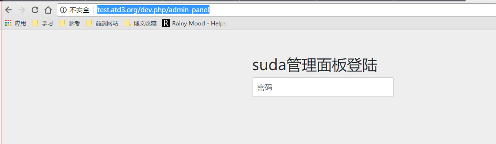
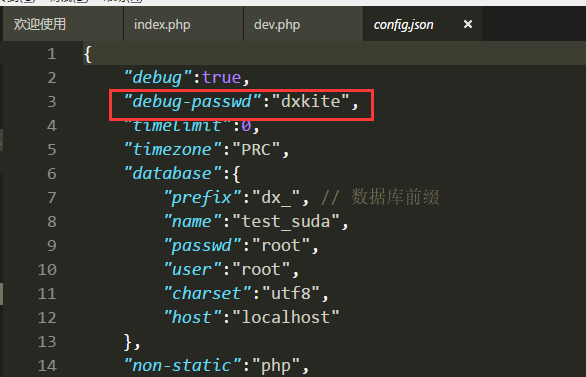
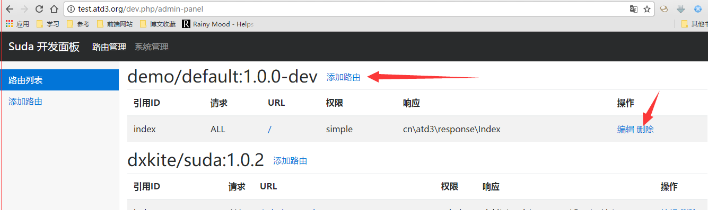
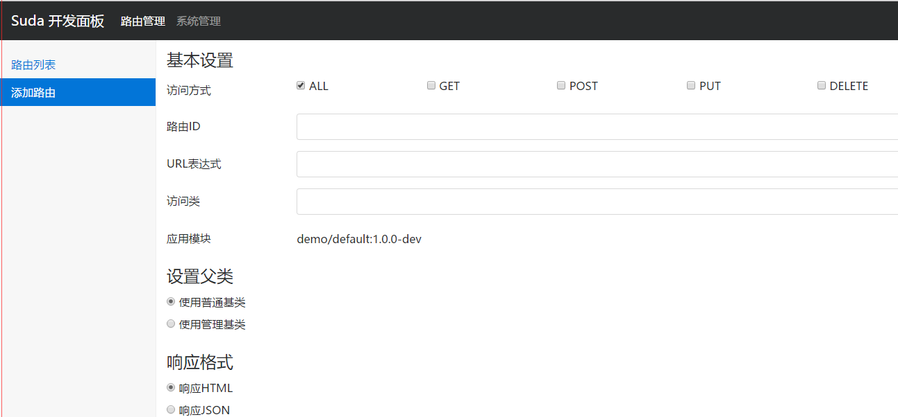
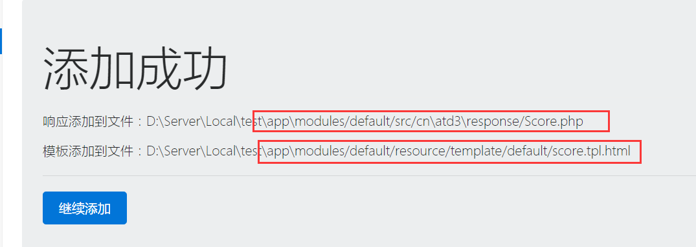
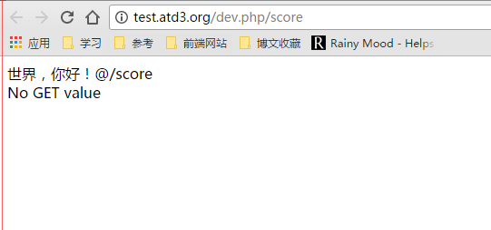

### 创建一个页面

---
#### 创建一个普通的HTML页面
打开页面： `http://test.atd3.org/dev.php/admin-panel` 会出现如下页面：

当前页面是网站的默认管理页面（开发者用）只能从本地访问。默认密码是`dxkite`
密码通过修改文件`app/resource/config/config.json`的`debug-passwd`字段来修改

登陆页面后，会进入到路由管理页面。在这个页面可以管理网站的所有
的对外URL和控制器。当前情况下会有suda模块和一个default模块，

点击上面的删除，删除index路由后，我们来添加个路由。

当前面板下面会出现一个添加路由的页面，我们可以通过这个来编辑他，
我们添加我们的第一个路由，名字叫做
`score`
url表达式为 `/score`
访问类修改为 `Score`
其他的默认不动。
添加成功后，我们可以看到反馈:

记住这两个路径，我下节教程将会用到。

访问路由`http://test.atd3.org/dev.php/score` 后我们可以看到如下页面：

添加页面的教程也就完成了。

#### 添加JSON返回页面

所有的东西如添加HTML页面一样，但是把响应格式修改为json就好，添加完后访问，可以得到如下效果：

