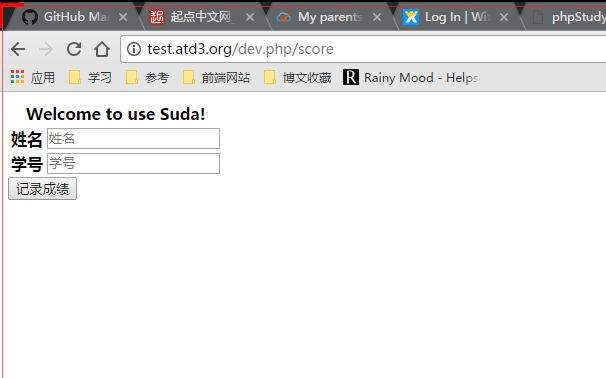
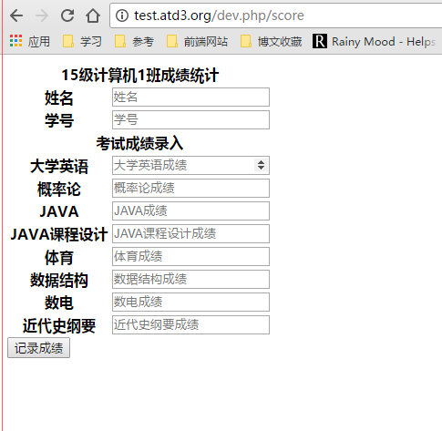

### 修改模板


---

#### 修改模板文件
打开上节课我所要求纪录的文件模板文件：
`app\modules\default\resource\template\default\score.tpl.html`
我们可以看到如下代码：

```html
<!DOCTYPE html>
<html>
    <head>
        <title>{{ $:title }}</title>
    </head>
    <body>
        <div> {{ _T($:helloworld) }}@/score </div>
        @if (count($_GET))
        <table>
            @foreach ($_GET as $name => $value)
            <tr><th>{{$name}}</th><td>{{$value}}</td></tr>
            @endforeach
        </table>
        @else
        <div>No GET value</div>
        @endif
    </body>
</html>
```

其中@开头的是我定制的模板扩展语言，具体请看[语法](../../tools/template.md)

当前页面会被编译成如下php代码(文件:`app\data\views\default\score.tpl`):
```php
<?php  class Template_e8cb17104273194612916ee930a3f6b2 extends suda\template\Template { protected $name="demo/default:1.0.0-dev:score"; protected function _render_template() {  ?><!DOCTYPE html>
<html>
    <head>
        <title><?php echo htmlspecialchars($this->get("title")); ?></title>
    </head>
    <body>
        <div> <?php echo htmlspecialchars(_T($this->get("helloworld"))); ?>@/score </div>
        <?php if(count($_GET)): ?>
        <table>
            <?php foreach($_GET as $name => $value): ?>
            <tr><th><?php echo htmlspecialchars($name); ?></th><td><?php echo htmlspecialchars($value); ?></td></tr>
            <?php endforeach; ?>
        </table>
        <?php else: ?>
        <div>No GET value</div>
        <?php endif; ?>
    </body>
</html><?php }}
```
我们把页面修改为如下代码:
```html
<html>

<head>
    <title>{{ $:title }}</title>
    <meta charset="utf-8">
</head>

<body>
    <form action="@u('mark_score')"  method="POST">
        <table>
            <tr>
                <th colspan="2">{{ $:title }}
                    <input type="title" name="text" value="{{$:title}}" hidden>
                </th>
            </tr>
            <tr>
                <th>姓名</th>
                <td><input type="text" name="name" placeholder="姓名" required></td>
            </tr>
            <tr>
                <th>学号</th>
                <td><input type="number" name="number" placeholder="学号" required></td>
            </tr>
            @if (count($:items([])))
            <tr>
                <th colspan="2">考试成绩录入</th>
            </tr>
            @foreach ( $:items as $name)
            <tr>
                <th>{{$name}}</th>
                <td> <input type="number" name="data[{{$name}}]" placeholder="{{$name}}成绩" required></td>
            </tr>
            @endforeach @endif
        </table>
        <div> <button> 记录成绩 </button> </div>
    </form>
</body>

</html>
```

访问后



蒽，不难看出，我当前做的是统计成绩的Demo
当前页面的效果也就显示出来了，但是光是有页面也不行，还要有数据，打开控制类文件：
`app\modules\default\src\cn\atd3\response\Score.php`

```php
<?php
namespace cn\atd3\response;

use suda\core\{Session,Cookie,Request,Query};

/**
* visit url /score as all method to run this class.
* you call use u('score',Array) to create path.
* @template: default:score.tpl.html
* @name: score
* @url: /score
* @param: 
*/
class Score extends \suda\core\Response
{
    public function onRequest(Request $request)
    {
        $page=$this->page('demo/default:1.0.0-dev:score');

        // params if had
        ;
        // param values array
        $value=array();
        // display template

        $page->set('title', 'Welcome to use Suda!')
        ->set('helloworld', 'Hello,World!')
        ->set('value', $value);

        return $page->render();
    }
}
```

当前文件是默认的文件，我们需要修改页面压入的变量：

```php
<?php
namespace cn\atd3\response;

use suda\core\{Session,Cookie,Request,Query};

class Score extends \suda\core\Response
{
    public function onRequest(Request $request)
    {
        $page=$this->page('demo/default:1.0.0-dev:score');
        $page->set('title', '15级计算机1班成绩统计');
        $page->set('items',['大学英语','概率论','JAVA','JAVA课程设计','体育','数据结构','数电','近代史纲要']);
        return $page->render();
    }
}
```
修改后，我们可以访问看看页面变量压入的效果



为什么会出现变化？就是之前的页面变量的压入。这个后期再仔细讲模板语言，这节课就讲这么多。

