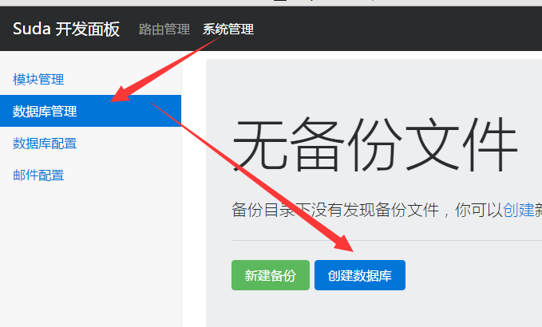

### 创建数据表

---

#### 添加DTO (Data Table Object)

打开路径 `app\modules\default\resource\dto`
添加文件：`score.dto`
```
;; 数据
id bigint(20) unsigned auto primary comment="ID"
name varchar(30) comment="姓名"
num varchar(8) comment="学号"
data text comment="数据"
```
本文件会被解析成SQL语句，用于创建数据表，数据表名为文件名`score`

#### 修改数据库配置
打开文件`app\resource\config\config.json`
修改数据库字段：
```json
    "database":{
        "prefix":"dx_", // 数据库前缀
        "name":"score",
        "user":"root",
        "passwd":"root",
        "charset":"utf8",
        "host":"localhost"
    },
```
把数据库相关配置修改好

#### 导入数据表
转到管理页面 `http://test.atd3.org/dev.php/admin-panel/system/database`


点击创建数据库后，等待数据库创建成功，
创建页面 `/mark_score`:
属性：名称 mark_score， 类 MarkScore ，路由 `/mark_score`

#### 修改模板，显示操作结果:
```html
<html>

<head>
    <meta charset="utf-8">
    <title>{{ $:title('成绩录入成功') }}</title>
</head>

<body>
    <div> {{ $:msg('成绩录入成功') }} </div>
</body>

</html>
```

#### 向写入数据库数据
```php
<?php
namespace cn\atd3\response;

use suda\core\{Session,Cookie,Request,Query};

class MarkScore extends \suda\core\Response
{
    public function onRequest(Request $request)
    {
        $page=$this->page('demo/default:1.0.0-dev:mark_score');
        $value=$request->post();
        $return=Query::insert('score',['num'=>$value->number,'name'=>$value->name,'data'=> json_encode($value->data) ]);
        if ($return>0){
            $msg='写入成功！';
        }else{
            $msg='写入失败！';
        }
        return $page->set('msg',$msg)->render();
    }
}
```
修改后，即可运行。
其中[Query](../../core/query.md)类是基本查询类，可以提供CRUD操作，具体请看[Query类方法](../../core/query.md)

