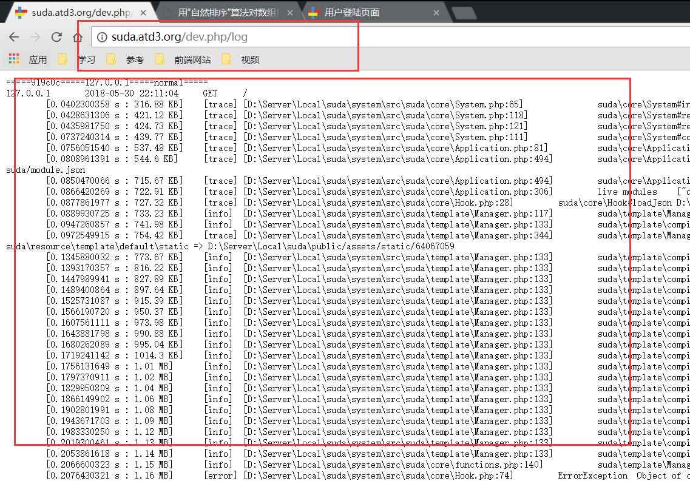

# 页面路由

## 什么是路由？
路由是框架对外可以访问的URL的一种映射关系，由文件 `router.json` 来指定，`router.json` 文件存储在模块的配置目录下，具体的
目录路径为：`模块目录/resource/config/router.json` 

## 路由的种类

目前框架支持3种路由页面，属性都用JSON描述

1. 静态页面

    用来生成静态文件或者静态网页的路由

2. 动态页面

    用来生成动态HTML网页的路由，但是不处理网页的动作

3. 活动页面

    用来处理浏览器提供的请求的路由，附带一个处理的脚本

## 路由基本属性

| 属性名 | 属性描述 | 类型 |
|-------|--------|------|
| url | 浏览器访问时的URL | string |
| method | 浏览器访问的请求头部方法限制 | array |
| source | 静态资源，静态资源使用的属性，可以在里面使用配置和常量 | string |
| class | 用于指定处理类，必须是 `suda\core\Response` 的子类 | string |
| template | 用于指定模板，动态页面基础属性 | string|
| hidden | 设置是否可以访问 |  bool |
| anti-prefix | 是否取消模块自动添加的页面路由前缀 | bool |


## 路由测试
 
> 本次测试使用的路由都为默认启动后的`app`模块

### 静态路由页面测试

打开文件 `app/modules/app/resource/config/config.json` 文件，现在文件的内容如下:

```json
{
    "index": {
        "class": "cn\\atd3\\response\\IndexResponse",
        "url": "\/"
    }
}
```

添加一条路由规则，命名为 `log` ,网页链接路由为 `/log` ，只允许使用 `GET` 方法访问，访问后显示日志文件`DATA_DIR/logs/latest.log`的内容
其中，`DATA_DIR` 指向为数据目录，在本次例子中为 `app/data/` 目录
添加后，现在的路由如下

```json
{
    "index": {
        "class": "cn\\atd3\\response\\IndexResponse",
        "url": "\/"
    },
    "log" : {
        "source": ":DATA_DIR/logs/latest.log",
        "url": "\/log"
    }
}
```

访问页面： `/log`

可以查看到类似如下的页面



### 添加动态的HTML
